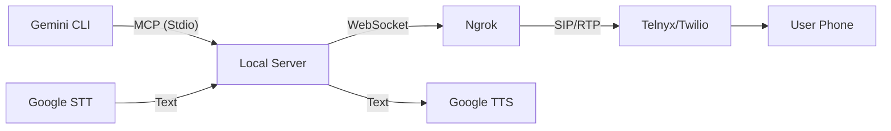

# Gemini Call Me 📞

**Gemini Call Me** is an MCP server extension that gives your AI agent the ability to call you on the phone. Designed for the Gemini ecosystem, it leverages **Google Cloud Text-to-Speech** and **Speech-to-Text** for high-quality, natural voice interactions.

Imagine starting a long-running task with Gemini CLI and walking away. When it's done—or if it needs a decision—your phone rings, and you can chat with the agent in real-time.

## Features

- 📱 **Real Phone Calls**: Initiates calls via **Telnyx** (recommended) or **Twilio**.
- 🗣️ **Google Voice AI**: Uses Google Cloud's Neural2 voices for natural speech and Speech-to-Text V2 for accurate transcription.
- 🔌 **MCP Compatible**: Works out-of-the-box with Gemini CLI and other MCP clients.
- 💬 **Two-Way Conversation**: Full "Reason and Act" loop support—the agent speaks, listens, and responds.

## Configuration & Setup

### 1. Provider Setup

#### 🔵 Option A: Telnyx (Recommended)
*Cheaper (~$0.007/min) and straightforward.*
1.  **Sign Up**: Go to [telnyx.com](https://telnyx.com) and create an account.
2.  **Get a Number**: Buy a Voice-capable number in the portal.
3.  **Create API Key**: Go to **Account Settings > Keys & Credentials** and create an API Key. This is your `CALLME_PHONE_AUTH_TOKEN`.
4.  **Create Connection**:
    - Go to **Voice > SIP Connections** (or Call Control Applications).
    - Create a new "Call Control" application.
    - Set the **Webhook URL** to your Ngrok URL + `/webhooks/voice` (e.g., `https://your-server.ngrok-free.app/webhooks/voice`).
    - *Note: If running locally, you'll update this URL every time Ngrok restarts unless you have a static domain.*
    - Copy the **Connection ID** (or App ID). This is your `CALLME_PHONE_ACCOUNT_SID`.
5.  **Assign Number**: Assign your purchased number to this Connection/App.

#### 🔴 Option B: Twilio
*Global standard, slightly more expensive.*
1.  **Sign Up**: Go to [twilio.com](https://twilio.com).
2.  **Get a Number**: Buy a number with Voice capabilities.
3.  **Credentials**: 
    - Copy **Account SID** from the dashboard. This is `CALLME_PHONE_ACCOUNT_SID`.
    - Copy **Auth Token**. This is `CALLME_PHONE_AUTH_TOKEN`.
4.  **Configure Number**:
    - Go to your Active Number settings.
    - Under "Voice & Fax", set "A Call Comes In" to **Webhook**.
    - Set the URL to your Ngrok URL + `/webhooks/voice` (e.g. `https://your-server.ngrok-free.app/webhooks/voice`).
    - Ensure it is set to **HTTP POST**.

#### 🟢 Option C: Plivo
*Great for India/Global markets.*
1.  **Sign Up**: Go to [plivo.com](https://plivo.com).
2.  **Get a Number**: Buy a voice-enabled number.
3.  **Credentials**:
    - Go to Dashboard.
    - Copy **Auth ID**. This is `CALLME_PHONE_ACCOUNT_SID`.
    - Copy **Auth Token**. This is `CALLME_PHONE_AUTH_TOKEN`.
4.  **Configure Application**:
    - Go to **Voice > Applications**.
    - Create a new Application (e.g., "Gemini Agent").
    - Set **Answer URL** to your Ngrok URL + `/webhooks/voice`.
    - Set Method to **POST**.
    - Click "Create Application".
5.  **Assign Number**: Go to your Phone Numbers and attach the purchased number to this Application.

### 2. Google Cloud Setup

1.  Create a project in [Google Cloud Console](https://console.cloud.google.com/).
2.  Enable **Cloud Text-to-Speech API**.
3.  Enable **Cloud Speech-to-Text API**.
4.  **Authentication**:
    - **Local**: Install `gcloud` CLI and run `gcloud auth application-default login`.
    - **Server**: Create a Service Account, download the JSON key, and set `GOOGLE_APPLICATION_CREDENTIALS=/path/to/key.json`.

### 3. Environment Variables

## Installation

1.  **Clone the repository**:
    ```bash
    git clone https://github.com/yourusername/gemini-call-me.git
    cd gemini-call-me
    ```

2.  **Install dependencies**:
    ```bash
    npm install
    ```

3.  **Configure Environment**:
    Copy the template and fill in your credentials.
    ```bash
    cp .env.template .env
    ```

    > **Note**: For Google Cloud authentication, ensure `GOOGLE_APPLICATION_CREDENTIALS` is set in your `.env` or run `gcloud auth application-default login`.

4.  **Build**:
    ```bash
    npm run build
    ```

## Installing in Gemini CLI

Once built, you can install this extension into Gemini CLI (or compatible agents) by pointing to this directory.

1.  **Ensure you have configured your `.env` file** as described in the Prerequisites.

2.  **Register the Extension**:
    Depending on your Gemini CLI version, you typically register a local extension by path.

    **Option A: Configuration File**
    Add the extension to your local `gemini.config.json` (or equivalent):
    ```json
    {
      "extensions": {
        "call-me": "/absolute/path/to/gemini-call-me"
      }
    }
    ```

    **Option B: CLI Command**
    ```bash
    gemini extension add ./gemini-call-me
    ```
    *(Adjust the command based on your specific Gemini CLI version documentation)*

    The extension will automatically start the MCP server using the configuration in `gemini-extension.json`.

## Usage

### Running Locally

To start the MCP server:

```bash
npm start
```

This will:
1.  Start the MCP server on stdio.
2.  Launch an HTTP server for webhooks.
3.  Automatically create an Ngrok tunnel to expose your local server to the phone provider.

### Using with Gemini CLI

Add the MCP server to your Gemini configuration (or other MCP client settings). Since this server needs to run indefinitely to handle webhooks, it's best suited as a persistent background server or launched directly by the client.

### Available Tools

When connected, the agent has access to:

- `initiate_call(message: string)`: Calls your configured number and speaks the message.
- `continue_call(call_id: string, message: string)`: Speaks a follow-up message and waits for your response.
- `speak_to_user(call_id: string, message: string)`: Speaks a message without waiting for a reply (useful for status updates).
- `end_call(call_id: string, message: string)`: Says goodbye and hangs up.

## Architecture

This project implements a local MCP server that acts as a bridge between the AI agent and the telephony network.



## Contributing

Contributions are welcome! Please open an issue or submit a pull request.

## License

[MIT](LICENSE)
